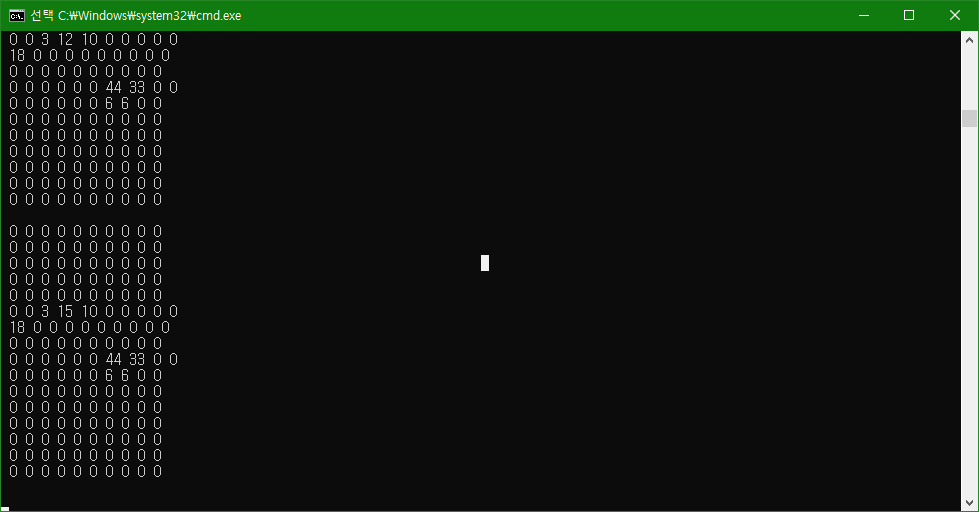

# klib2-python

Simple example of Processing API for Snowforce 3.

DEVELOPMENT ENVIRONMENT
-----------------------
* Python https://www.python.org
* Snowforce 3
   * https://www.kitronyx.com/downloads.html
   * http://sites.kitronyx.com/wiki/applications/snowforce-3

QUICK START
-----------
* Download or clone source code
* Open and run `klib2-python.py`.
